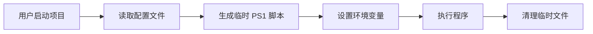

# TEVM - Temporary Environment Variable Manager

<div align="center">

**一个优雅的临时环境变量管理工具**

[English](README.md) | [简体中文](README_CN.md)

</div>

## 📖 简介

TEVM (Temporary Environment Variable Manager) 是一个轻量级的环境变量管理工具,帮助您为不同项目配置独立的环境变量和可执行文件。通过生成临时 PowerShell 脚本,TEVM 可以在不污染系统环境的情况下运行您的项目。

### ✨ 核心特性

- 🎯 **项目隔离**: 为每个项目配置独立的环境变量
- 🖥️ **双界面支持**: 提供 CLI 命令行和 Web GUI 图形界面
- 🚀 **快速启动**: 自动生成 .bat 启动脚本
- 🔒 **临时执行**: 环境变量仅在项目运行时生效
- 📦 **内置 Python**: 自带独立 Python 解释器,无需系统安装

## 🚀 快速开始

### 安装

```bash
# 克隆仓库
git clone https://github.com/NuhilLucas/Temporary-Environment-Variable-Manager.git
cd Temporary-Environment-Variable-Manager
```

### 基本使用

#### CLI 命令行模式

```bash
# 查看帮助
tevm help

# 创建新项目
tevm project new

# 列出所有项目
tevm project list

# 删除项目
tevm project del --name <project_name>

# 修改项目
tevm project modify --name <project_name>
```

#### GUI 图形界面模式

```bash
# 启动 Web GUI
tevm project gui

# 启动 GUI 并开启调试模式
tevm project gui -debug
```

## 📁 项目结构

```
TEVM/
├── src/tevm/           # 核心源代码
│   ├── cli/           # CLI 接口实现
│   ├── gui/           # GUI 接口实现
│   ├── lib/           # 工具库
│   └── instance.py    # 全局状态管理
├── config/            # 配置文件目录
│   └── projects.json  # 项目配置
├── scripts/           # 生成的启动脚本
├── temp/              # 临时文件
└── python_standalone/ # 内置 Python 解释器
```

## 🔧 配置说明

项目配置存储在 `config/projects.json` 中,格式如下:

```json
{
  "project_name": {
    "executables": {
      "path/to/executable": "command_line_args"
    },
    "envars": {
      "ENV_VAR_NAME": "value"
    }
  }
}
```

### 配置项说明

- **executables**: 项目需要执行的程序及其参数
  - 支持绝对路径和相对路径(相对路径使用 `rel|/` 前缀)
- **envars**: 项目的环境变量键值对

## 💡 工作原理



TEVM 通过以下步骤工作:

1. 从 `projects.json` 读取项目配置
2. 生成临时 PowerShell 脚本,包含环境变量设置
3. 在隔离环境中执行配置的程序
4. 执行完成后自动清理临时文件

## 🛠️ 开发

### 系统要求

- Windows 操作系统
~~- Python 3.x (或使用内置的 python_standalone)~~

### 核心模块

- **instance.py**: 全局状态初始化和路径配置
- **cli/api.py**: CLI 命令处理和路由
- **gui/**: Web GUI 界面(基于 pywebview)
- **lib/scripter.py**: 脚本生成器
- **lib/config_rw.py**: 配置文件读写

## 📝 示例

### 创建一个新项目

```bash
tevm project new --name my_project
# 按提示输入:
# 1. 可执行文件路径
# 2. 执行参数
# 3. 环境变量(可选)
```

### 使用生成的启动脚本

创建项目后,会在 `scripts/` 目录生成对应的 `.bat` 文件:

```bash
scripts/my_project.bat
```

在命令行运行该脚本即可启动项目。

## 🤝 贡献

欢迎提交 Issue 和 Pull Request!

## 📄 许可证

[]

## 👤 作者

NuhilLucas

---

<div align="center">
Made with ❤️ by NuhilLucas
</div>